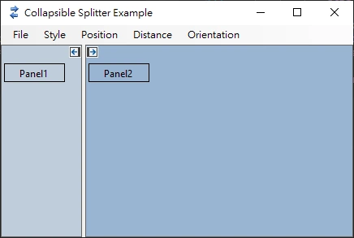

# CollapsibleSplitcontainer
============

CollapsibleSplitcontainer is a UserControl written in .Net Framework 4.8, expandable/collapsable split container which extends SplitContainer.  

This repository mirrors source code of [Collapsible-Split-Container](https://www.codeproject.com/Articles/820888/Collapsible-Split-Container) project created by Ed Gadziemski.  

> forked from https://www.codeproject.com/Articles/820888/Collapsible-Split-Container  
> Collapsible Split Container  
> (c) 2014 Ed Gadziemski, v. 1.0.0.2  
> Last updated 9/18/2014  
> Licensed under Code Project Open License  

___

Changes in this version:  

1. Change the Collapse button to the Forms button type, which originally used the OnPaint event to draw a simulated button.
2. Change the position of the Collapse button from Splitter to panel1, panel2

___

# Properties

## SplitterButtonBitmap

- Determine the background image of the splitter button, or use the default background image

## SplitterButtonLocation

- Determines whether to place collapse buttons on both sides of the splitter or on one side of Panel1 and Panel2
- Panel: The location of the splitter button is on both sides of the panel  
- Panel1: The location of the splitter button is in Panel1  
- Panel2: The location of the splitter button is in Panel2  

## SplitterButtonPosition

- TopLeft: splitter button on the top left
- Center: splitter button is in the middle
- BottomRight: splitter button at bottom right

## SplitterButtonStyle

- Determines the style of splitter buttons
- None: don't show the splitter button  
- Image: Display the double splitter button (the button function is to determine the collapse direction of the panel, upper left or lower right)  
- SingleImage: Displays a single splitter button (according to the collapsed state of the panel, the button automatically determines whether it is upper left or lower right)  

## SplitterButtonSize

- Determines the size of the splitter button, the default is 16

## SplitterCollapseDistance

- Determines the style of the splitter after collapsing: MinSize - maintains minimum width; Collapsed - fully collapses
- MinSize: the panel collapses to the specified MinSize
- Collapsed: One-sided panel completely collapsed

## SingleImageCollapsePanel2

- Determines whether to collapse Panel2; if not, Panel1 will collapse. This setting only takes effect when SplitterButtonStyle is SingleImage and the location of the splitter button is on either Panel1 or Panel2.